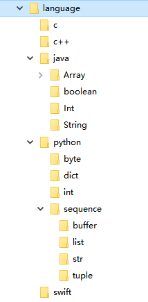

## 不要猜中的小游戏
### 背景
和女朋友闲待着两个人无聊，都想吃苹果又都不想洗，想起玩过的一个酒桌上猜数字的游戏，然后在手机上写了出来，三局两胜输了去洗苹果……
### 游戏介绍
零到99(包括边界)，随机一个数两人(N人也可以)轮流猜测，如果没猜中，新的数将做为边界，一步步缩小可以猜测的范围，直到猜中为止，比如随机数是“32”，屏幕首先打印出：

`当前范围是: 0 --- 100`

第一次猜：50，屏幕返回

`当前范围是: 0 --- 50`

第二次猜：25,屏幕返回

`当前范围是: 25 --- 50`

第N次猜中：32，屏幕返回，并结束循环

`^_^`

### 准备工作
此前我们的代码都是在交互环境中完成的，是时候来点不一样的了。在学前班里我们介绍了一些文本编辑器，现在召唤一个你喜欢的，然后开始编写吧。

多行的Python代码稍微有些不同，下面的代码可以当做是一个参考。良好的代码编写应该是有缩进的，这样方面人类阅读和理解，Python解释器对缩进的要求是严格的，也就是说你必须进行缩进，缩进量通常为'2个空格或者4个空格'，注意不要用'Tab'和4个空格混用，因为不同编辑器可能会对'Tab'的缩进理解不同。

那么问题来了，什么时候需要缩进呢？大概像下图一样：

缩进描述的是属于关系，每有一层属于关系就需要缩进一次。

写好了程序后，比如存为`abc.py`，
在windows中进入相行目录，比如C盘下的py_ex，在Windows的命令行中输入：

    C:\>python c:\py_ex\abc.py
或者

    cd c:\py_ex\abc.py
    C:\py_ex\>python abc.py
    
在Linux或OSX的终端中输入python + 文件路径，比如要运行家目录内py_ex中的abc.py文件:

    $ python ~/py_ex/abc.py

### 代码(Python3)
下面的代码是Python3的，如果是Python2你还需要在`import`之前再加入一行`# -*- coding: utf-8 -*-`，来确保代码内的中文字符可以运行。

    import random

    rand_num = random.randint(0, 99)
    left = 0
    right = 99
    while True:
        print('当前范围是：', left, '---', right)
        test = int(input('再猜一下\n'))
        if test == rand_num:
            print('^_^')
            break
        if test > rand_num:
            right = test
        else:
            left = test
            
### 代码注解
第一行我们先引入了一个可以产生随机数的包，这里我们需要的是整数所以使用random.randint()方法，这个方法接收两个参数做为左右边界，返回一个包含边界的随机整数。

第六行，一个永恒循环来接收N次猜数，如果猜中`break`跳出循环。

第八行的input是一个内建函数用来接收输入信息，默认接收到的输入会是str类型，我们对其进行了强制类型转换，这里不严谨，没有进行严格的输入验证。

### 如果有疑问
有疑问是正常的，因为像`if`和`while`这样的控制语句我们之前并没有提过，但是没关系，即使没有提到过，你也一样看得懂，不是吗？ 这里看明白就好，后续的章节我们会详细介绍。